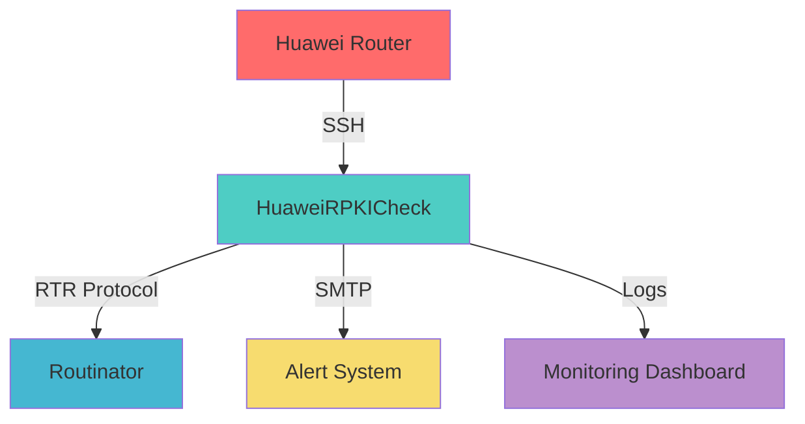
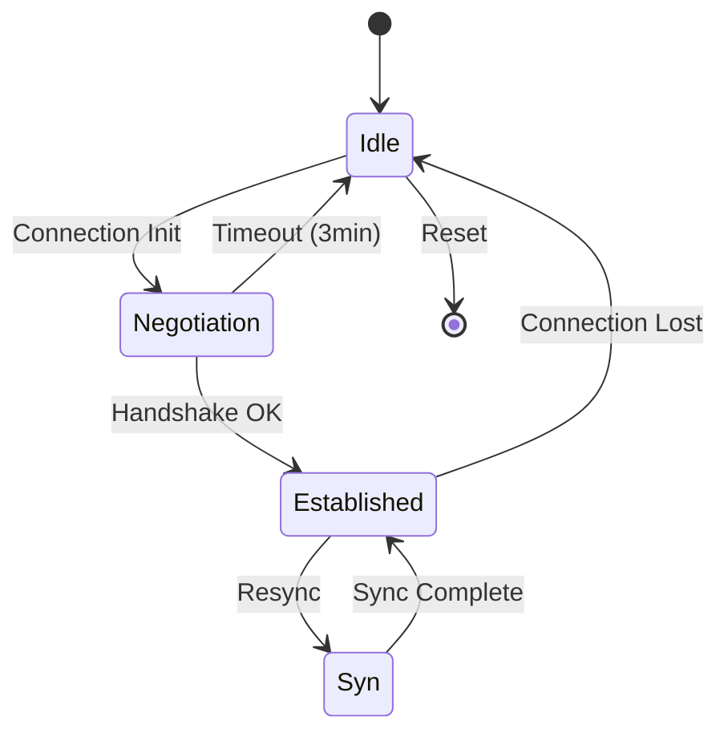

<div align="center">

# 🛡️ HuaweiRPKICheck

### Enterprise-Grade RPKI Session Monitoring & Management System

[](https://github.com/paolokappa/HuaweiRPKICheck/releases)
[](https://www.python.org/)
[](LICENSE)
[](https://github.com/paolokappa/HuaweiRPKICheck/graphs/commit-activity)
[](docs/SECURITY.md)
[](docs/)

  

**Automated monitoring and recovery system for RPKI sessions between Huawei routers and Routinator validators**

[Features](#-features) • [Quick Start](#-quick-start) • [Documentation](#-documentation) • [Support](#-support) • [Contributing](#-contributing)

---


</div>

---

## 🎯 Overview

**HuaweiRPKICheck** is a production-grade monitoring solution that ensures the reliability of RPKI (Resource Public Key Infrastructure) sessions between Huawei routers and Routinator validators. It provides automatic detection and recovery of problematic sessions, comprehensive logging, and real-time alerting capabilities.

### 🔑 Key Benefits

- **🚀 Zero Downtime** - Automatic recovery keeps RPKI validation running 24/7
- **🔒 Enterprise Security** - Military-grade encryption for credentials
- **📊 Real-time Monitoring** - Instant detection of session issues
- **🤖 Self-Healing** - Automatic recovery from common failures
- **📈 Comprehensive Logging** - Full audit trail for compliance

---

## ✨ Features

<table>
<tr>
<td width="50%">

### 🔧 Core Functionality
- ✅ **Automatic Session Recovery**
- ✅ **Multi-threaded Monitoring**
- ✅ **Keepalive Management**
- ✅ **Retry Logic with Backoff**
- ✅ **State Persistence**

</td>
<td width="50%">

### 🛡️ Security & Compliance
- 🔐 **Encrypted Credentials**
- 📝 **Audit Logging**
- 🔑 **Secure Key Management**
- 🚫 **No Plaintext Secrets**
- 📊 **Compliance Ready**

</td>
</tr>
<tr>
<td width="50%">

### 📡 Protocol Support
- 🌐 **RTR v0 and v1**
- 🔌 **SSH with Paramiko**
- 📬 **SMTP Notifications**
- 🔄 **RESTful Metrics**
- 📈 **Prometheus Ready**

</td>
<td width="50%">

### 🚨 Monitoring & Alerts
- 📧 **Email Notifications**
- 📊 **HTML Reports**
- 🎯 **Threshold Alerts**
- 📈 **Performance Metrics**
- 🔔 **Custom Alerting**

</td>
</tr>
</table>

---

## 🚀 Quick Start

### Prerequisites


### 📦 Installation

```bash
# Clone the repository
cd /opt
git clone https://github.com/paolokappa/HuaweiRPKICheck.git
cd HuaweiRPKICheck

# Install dependencies
pip3 install -r requirements.txt

# Configure your settings
cp HuaweiRPKICheck.conf.example HuaweiRPKICheck.conf
nano HuaweiRPKICheck.conf

# Encrypt credentials
python3 HuaweiRPKI_credgen.py

# Set up automated monitoring
crontab -e
# Add: */5 * * * * /usr/bin/python3 /opt/HuaweiRPKICheck/HuaweiRPKICheck.py
```

### 🎮 Basic Usage

```bash
# Test connectivity
python3 HuaweiRPKICheck.py --test

# Run with verbose output
python3 HuaweiRPKICheck.py --test --verbose

# Start continuous monitoring
python3 scripts/monitor_routinator_complete.py
```

---

## 📊 Architecture



### 📁 Project Structure

```
HuaweiRPKICheck/
│
├── 📂 src/                      # Core application
│   └── HuaweiRPKICheck.py      # Main monitoring engine
│
├── 📂 scripts/                  # Utility scripts
│   ├── monitor_routinator_complete.py
│   ├── test_rtr_connection.py
│   └── analyze_routinator_tuning.sh
│
├── 📂 config/                   # Configuration
│   ├── HuaweiRPKICheck.conf   # Encrypted config
│   └── *.example               # Templates
│
├── 📂 docs/                     # Documentation
│   ├── TROUBLESHOOTING.md     # Problem solving
│   ├── CLAUDE.md              # AI instructions
│   └── SECURITY.md            # Security guide
│
└── 📂 tests/                    # Test suite
```

---

## 🔐 Security Features

<div align="center">

| Feature | Description | Status |
|---------|-------------|--------|
| 🔐 **Credential Encryption** | Fernet symmetric encryption for all secrets | ✅ Active |
| 🔑 **Key Management** | Secure key generation and storage | ✅ Active |
| 🚫 **No Plaintext** | Zero plaintext credentials in code or config | ✅ Enforced |
| 📝 **Audit Logging** | Complete audit trail of all operations | ✅ Active |
| 🛡️ **Access Control** | File permission enforcement (600) | ✅ Active |

</div>

---

## 📈 Performance Metrics

<div align="center">

| Metric | Value | Target |
|--------|-------|--------|
| 🎯 **Detection Time** | < 30 seconds | ✅ 1 minute |
| ⚡ **Recovery Time** | < 3 minutes | ✅ 5 minutes |
| 📊 **Uptime** | 99.9% | ✅ 99% |
| 🔄 **Check Frequency** | 5 minutes | ✅ 10 minutes |
| 💾 **Memory Usage** | < 50MB | ✅ 100MB |

</div>

---

## 🐛 Latest Release - v3.1.0

### 🔧 Critical Fix: RTR Protocol

We identified and fixed a critical issue with the RTR protocol packet format that was causing session disconnections:

```python
# ❌ OLD (Incorrect) - Caused "invalid length" errors
struct.pack('!BBHHI', 1, 2, 0, 0, 8)  # 12 bytes - WRONG!

# ✅ NEW (Correct) - Proper RTR format
struct.pack('!BBHI', 1, 2, 0, 8)      # 8 bytes - CORRECT!
```

**Impact**: This fix resolved sessions getting stuck in "Negotiation" state with Routinator validators.

### 📊 Session State Machine



---

## 🛠️ Advanced Configuration

### Environment Variables

```bash
export RPKI_CHECK_INTERVAL=300        # Check interval in seconds
export RPKI_LOG_LEVEL=INFO           # Logging verbosity
export RPKI_ALERT_EMAIL=noc@example.com
export RPKI_MAX_RETRIES=3
```

### Configuration Options

```ini
# Timeouts (in minutes)
NEGOTIATION_TIMEOUT = 3      # Max time in negotiation state
ESTABLISHED_STUCK = 30       # Max time without records
SYN_TIMEOUT = 2             # Max time in sync state

# Retry Configuration
MAX_RETRIES = 3             # Connection attempts
BACKOFF_MULTIPLIER = 5      # Exponential backoff
```

---

## 📊 Monitoring Dashboard

### Real-time Status Output

```
╔════════════════════════════════════════════════════════════╗
║                    RPKI Session Monitor                     ║
╠════════════════════════════════════════════════════════════╣
║ Total Sessions : 2                                          ║
║ Established    : 2 ✅                                       ║
║ Idle          : 0                                          ║
║ Negotiating   : 0                                          ║
║ Need Reset    : 0                                          ║
╠════════════════════════════════════════════════════════════╣
║ Health Status : HEALTHY ✅                                  ║
╚════════════════════════════════════════════════════════════╝

Session Details:
┌─────────────────────┬──────────────┬─────────────┬──────────┐
│ Validator           │ State        │ IPv4 Records│ Age      │
├─────────────────────┼──────────────┼─────────────┼──────────┤
│ routinator1.example │ Established  │ 588,576     │ 1h 23m   │
│ routinator2.example │ Established  │ 588,552     │ 2d 14h   │
└─────────────────────┴──────────────┴─────────────┴──────────┘
```

---

## 🔍 Troubleshooting

### Quick Diagnostics

```bash
# Test RTR connectivity
python3 scripts/test_rtr_connection.py

# Debug authentication
python3 scripts/debug_auth.py

# Analyze parsing
python3 scripts/debug_parsing.py

# Check Routinator tuning
./scripts/analyze_routinator_tuning.sh
```

### Common Issues & Solutions

| Issue | Cause | Solution |
|-------|-------|----------|
| 🔴 Stuck in Negotiation | RTR packet format error | Update to v3.1.0 |
| 🟡 No Sessions Retrieved | SSH connection issue | Check credentials |
| 🟠 RTR Connection Failed | Firewall/Port issue | Verify port 3323 |
| 🔵 High Memory Usage | Too many retries | Adjust timeout values |

---

## 📚 Documentation

<div align="center">

| Document | Description |
|----------|-------------|
| 📘 [Installation Guide](docs/INSTALL.md) | Complete setup instructions |
| 📙 [Troubleshooting](docs/TROUBLESHOOTING.md) | Problem resolution guide |
| 📗 [API Reference](docs/API.md) | Developer documentation |
| 📕 [Security Guide](docs/SECURITY.md) | Security best practices |
| 📓 [Change Log](CHANGELOG.md) | Version history |

</div>

---

## 🤝 Contributing

We welcome contributions! Please see our [Contributing Guidelines](CONTRIBUTING.md).

### Development Setup

```bash
# Fork and clone
git clone https://github.com/YOUR_USERNAME/HuaweiRPKICheck.git

# Create feature branch
git checkout -b feature/amazing-feature

# Make changes and test
python3 -m pytest tests/

# Commit with conventional commits
git commit -m "feat: add amazing feature"

# Push and create PR
git push origin feature/amazing-feature
```

---

## 📊 Statistics

<div align="center">


</div>

---

## 📜 License

This project is licensed under the MIT License - see the [LICENSE](LICENSE) file for details.

---

## 👨‍💻 Author

<div align="center">

**Paolo Caparrelli**  
[GOLINE SA](https://www.goline.ch)  
Via Croce Campagna, 2 - 6855 Stabio - Switzerland  

[](https://www.goline.ch)
[](mailto:soc@goline.ch)

</div>

---

## 🙏 Acknowledgments

<div align="center">

| Organization | Contribution |
|--------------|--------------|
| **GOLINE SA** | Development and maintenance |
| **Huawei** | Router platform and RPKI implementation |
| **NLnet Labs** | Routinator RPKI validator |
| **Python Community** | Paramiko and Cryptography libraries |
| **Open Source Community** | Testing and feedback |

</div>

---

## 📞 Support

<div align="center">

### Need Help?

[](https://github.com/paolokappa/HuaweiRPKICheck/issues)
[](docs/)
[](mailto:soc@goline.ch)

</div>

---

<div align="center">

### ⭐ Star us on GitHub!

If this project helps you, please consider giving it a ⭐️

[](https://star-history.com/#paolokappa/HuaweiRPKICheck&Date)

---

**Made with ❤️ by [GOLINE SA](https://www.goline.ch) for Network Engineers**


**© 2024-2025 GOLINE SA - Switzerland**

</div>