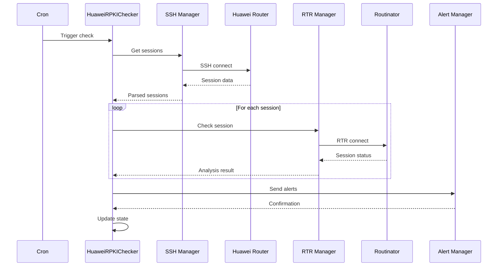
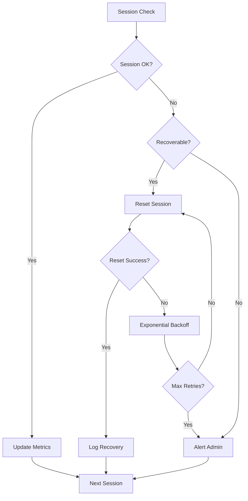

# System Architecture Guide

## Table of Contents
- [Overview](#overview)
- [Core Architecture](#core-architecture)
- [Component Design](#component-design)
- [Data Flow](#data-flow)
- [Deployment Patterns](#deployment-patterns)
- [Scalability Considerations](#scalability-considerations)

## Overview

HuaweiRPKICheck implements a multi-layered architecture designed for high availability, fault tolerance, and scalability in enterprise BGP environments.

### Design Principles

1. **Separation of Concerns**: Each component has a single, well-defined responsibility
2. **Fault Isolation**: Failures in one component don't cascade to others
3. **Stateless Operations**: No shared state between monitoring cycles
4. **Defensive Programming**: Handle all edge cases and unexpected inputs
5. **Security by Design**: Encryption and authentication at every layer

## Core Architecture

```
┌─────────────────────────────────────────────────────────────────┐
│                         Control Plane                            │
├─────────────────────────────────────────────────────────────────┤
│                                                                  │
│  ┌──────────────┐  ┌──────────────┐  ┌──────────────┐         │
│  │   Scheduler  │  │   Alerting   │  │   Metrics    │         │
│  │    (Cron)    │  │   Manager    │  │   Collector  │         │
│  └──────┬───────┘  └──────┬───────┘  └──────┬───────┘         │
│         │                  │                  │                 │
│         └──────────────────┴──────────────────┘                │
│                            │                                    │
│                  ┌─────────▼──────────┐                        │
│                  │                     │                        │
│                  │  HuaweiRPKIChecker  │                        │
│                  │    Main Engine      │                        │
│                  │                     │                        │
│                  └─────────┬──────────┘                        │
│                            │                                    │
├─────────────────────────────┴────────────────────────────────────┤
│                         Data Plane                              │
├─────────────────────────────────────────────────────────────────┤
│                                                                  │
│  ┌──────────────┐  ┌──────────────┐  ┌──────────────┐         │
│  │     SSH      │  │     RTR      │  │   Logging    │         │
│  │   Manager    │  │   Protocol   │  │   System     │         │
│  └──────┬───────┘  └──────┬───────┘  └──────┬───────┘         │
│         │                  │                  │                 │
│         ▼                  ▼                  ▼                 │
│  ┌──────────────┐  ┌──────────────┐  ┌──────────────┐         │
│  │   Huawei     │  │  Routinator  │  │  File System │         │
│  │   Routers    │  │  Validators  │  │   Storage    │         │
│  └──────────────┘  └──────────────┘  └──────────────┘         │
│                                                                  │
└─────────────────────────────────────────────────────────────────┘
```

## Component Design

### 1. Main Engine (HuaweiRPKIChecker)

**Responsibilities:**
- Orchestrate monitoring cycles
- Manage component lifecycle
- Coordinate error recovery
- Maintain system state

**Key Methods:**
```python
class HuaweiRPKIChecker:
    def __init__(self):
        self.ssh_manager = EnhancedInteractiveSSH()
        self.rtr_manager = RTRProtocolManager()
        self.alert_manager = AlertManager()
        self.state_manager = StateManager()
    
    def run_check_cycle(self):
        """Main monitoring cycle"""
        sessions = self.ssh_manager.get_sessions()
        analysis = self.analyze_sessions(sessions)
        self.handle_issues(analysis)
        self.update_state(analysis)
```

### 2. SSH Manager (EnhancedInteractiveSSH)

**Responsibilities:**
- Establish secure connections
- Manage interactive shells
- Handle authentication
- Maintain keepalive threads

**Connection Pool Pattern:**
```python
class ConnectionPool:
    def __init__(self, max_connections=10):
        self.pool = Queue(maxsize=max_connections)
        self.active = {}
        
    def get_connection(self, host):
        if host in self.active:
            return self.active[host]
        
        conn = self._create_connection(host)
        self.active[host] = conn
        return conn
```

### 3. RTR Protocol Manager

**Responsibilities:**
- Implement RTR protocol (RFC 8210)
- Handle packet encoding/decoding
- Manage session negotiation
- Process ROA updates

**Protocol State Machine:**
```python
class RTRStateMachine:
    states = {
        'IDLE': {'connect': 'NEGOTIATING'},
        'NEGOTIATING': {
            'success': 'ESTABLISHED',
            'timeout': 'IDLE',
            'error': 'IDLE'
        },
        'ESTABLISHED': {
            'sync': 'SYNCING',
            'disconnect': 'IDLE',
            'error': 'IDLE'
        },
        'SYNCING': {
            'complete': 'ESTABLISHED',
            'error': 'IDLE'
        }
    }
```

### 4. Alert Manager

**Responsibilities:**
- Threshold monitoring
- Alert deduplication
- Notification dispatch
- Escalation management

**Alert Pipeline:**
```python
class AlertPipeline:
    def __init__(self):
        self.filters = []
        self.dispatchers = []
        
    def process_alert(self, alert):
        # Filter chain
        for filter in self.filters:
            if not filter.should_pass(alert):
                return
        
        # Dispatch chain
        for dispatcher in self.dispatchers:
            dispatcher.send(alert)
```

### 5. State Manager

**Responsibilities:**
- Persist session state
- Track historical data
- Manage recovery points
- Handle rollbacks

**State Persistence:**
```python
class StateManager:
    def __init__(self, state_file='rpki_state.json'):
        self.state_file = state_file
        self.state = self.load_state()
        self.history = deque(maxlen=100)
        
    def checkpoint(self):
        """Create recovery point"""
        self.history.append(copy.deepcopy(self.state))
        self.save_state()
```

## Data Flow

### 1. Monitoring Cycle Flow



### 2. Error Recovery Flow



## Deployment Patterns

### 1. Single Instance Deployment

**Suitable for:**
- Small to medium networks (< 10 routers)
- Single Routinator instance
- Basic monitoring requirements

**Configuration:**
```ini
[deployment]
mode = single
check_interval = 300
max_threads = 5
```

### 2. Distributed Deployment

**Suitable for:**
- Large networks (> 10 routers)
- Multiple Routinator instances
- Geographic distribution

**Architecture:**
```
┌─────────────┐     ┌─────────────┐     ┌─────────────┐
│  Monitor 1  │     │  Monitor 2  │     │  Monitor 3  │
│  (Region A) │     │  (Region B) │     │  (Region C) │
└──────┬──────┘     └──────┬──────┘     └──────┬──────┘
       │                   │                   │
       └───────────────────┴───────────────────┘
                           │
                  ┌────────▼────────┐
                  │  Central DB/API  │
                  └─────────────────┘
```

### 3. High Availability Deployment

**Suitable for:**
- Critical infrastructure
- Zero-downtime requirements
- Compliance environments

**HA Architecture:**
```
┌──────────────┐         ┌──────────────┐
│   Primary    │◄────────► Secondary    │
│   Monitor    │  Sync   │   Monitor    │
└──────┬───────┘         └──────┬───────┘
       │                         │
       │      ┌─────────┐       │
       └──────► Router  ◄────────┘
              └─────────┘
```

**Failover Configuration:**
```python
class HAManager:
    def __init__(self, role='primary'):
        self.role = role
        self.peer = None
        self.heartbeat_interval = 10
        
    def start_heartbeat(self):
        """Monitor peer health"""
        while True:
            if not self.check_peer():
                self.promote_to_primary()
            time.sleep(self.heartbeat_interval)
```

## Scalability Considerations

### 1. Horizontal Scaling

**Router Distribution:**
```python
def distribute_routers(routers, workers):
    """Distribute routers among workers"""
    chunks = []
    chunk_size = len(routers) // workers
    
    for i in range(workers):
        start = i * chunk_size
        end = start + chunk_size if i < workers - 1 else len(routers)
        chunks.append(routers[start:end])
    
    return chunks
```

### 2. Performance Optimization

**Connection Pooling:**
```python
class OptimizedSSHPool:
    def __init__(self, min_size=2, max_size=10):
        self.min_size = min_size
        self.max_size = max_size
        self.pool = []
        self.in_use = []
        
        # Pre-create minimum connections
        for _ in range(self.min_size):
            self.pool.append(self._create_connection())
```

**Async Processing:**
```python
async def check_sessions_async(routers):
    """Async session checking"""
    tasks = []
    
    async with aiohttp.ClientSession() as session:
        for router in routers:
            task = asyncio.create_task(
                check_router_async(session, router)
            )
            tasks.append(task)
        
        results = await asyncio.gather(*tasks)
    
    return results
```

### 3. Resource Management

**Memory Optimization:**
```python
class MemoryEfficientLogger:
    def __init__(self, max_size=100_000_000):  # 100MB
        self.max_size = max_size
        self.current_size = 0
        
    def write(self, message):
        msg_size = len(message.encode('utf-8'))
        
        if self.current_size + msg_size > self.max_size:
            self.rotate()
        
        self._write_message(message)
        self.current_size += msg_size
```

**CPU Optimization:**
```python
def optimize_parsing(output):
    """Use compiled regex for better performance"""
    # Pre-compile patterns
    patterns = {
        'session': re.compile(
            r'(\d+\.\d+\.\d+\.\d+)\s+'
            r'(Established|Idle|Negotiation|Syn)\s+'
            r'(\S+)\s+(\d+)/(\d+)',
            re.MULTILINE
        )
    }
    
    return patterns['session'].findall(output)
```

## Database Schema

### Session History Table
```sql
CREATE TABLE session_history (
    id SERIAL PRIMARY KEY,
    timestamp TIMESTAMP NOT NULL,
    router_ip INET NOT NULL,
    validator_ip INET NOT NULL,
    state VARCHAR(20) NOT NULL,
    ipv4_records INTEGER,
    ipv6_records INTEGER,
    duration_seconds INTEGER,
    reset_count INTEGER DEFAULT 0,
    error_message TEXT,
    INDEX idx_timestamp (timestamp),
    INDEX idx_router_validator (router_ip, validator_ip)
);
```

### Alert History Table
```sql
CREATE TABLE alert_history (
    id SERIAL PRIMARY KEY,
    timestamp TIMESTAMP NOT NULL,
    severity VARCHAR(10) NOT NULL,
    router_ip INET,
    validator_ip INET,
    message TEXT NOT NULL,
    acknowledged BOOLEAN DEFAULT FALSE,
    acknowledged_by VARCHAR(100),
    acknowledged_at TIMESTAMP,
    INDEX idx_severity_ack (severity, acknowledged)
);
```

## Integration Points

### 1. Monitoring Systems

**Prometheus Exporter:**
```python
class PrometheusExporter:
    def __init__(self, port=9090):
        self.port = port
        self.metrics = {
            'sessions_total': Gauge('rpki_sessions_total'),
            'sessions_established': Gauge('rpki_sessions_established'),
            'sessions_errors': Counter('rpki_sessions_errors_total'),
            'reset_operations': Counter('rpki_reset_operations_total')
        }
```

### 2. Configuration Management

**Ansible Integration:**
```yaml
- name: Deploy HuaweiRPKICheck
  hosts: monitoring_servers
  tasks:
    - name: Copy application
      copy:
        src: /opt/HuaweiRPKICheck/
        dest: /opt/HuaweiRPKICheck/
        mode: '0755'
    
    - name: Install dependencies
      pip:
        requirements: /opt/HuaweiRPKICheck/requirements.txt
    
    - name: Configure cron
      cron:
        name: RPKI Check
        minute: "*/5"
        job: /usr/bin/python3 /opt/HuaweiRPKICheck/HuaweiRPKICheck.py
```

### 3. CI/CD Pipeline

**GitLab CI Configuration:**
```yaml
stages:
  - test
  - build
  - deploy

test:
  stage: test
  script:
    - python3 -m pytest tests/
    - python3 -m pylint src/

deploy:
  stage: deploy
  script:
    - ansible-playbook deploy.yml
  only:
    - main
```

## Security Architecture

### Defense in Depth

```
Layer 1: Network Security
├── Firewall rules
├── VPN/IPSec tunnels
└── Network segmentation

Layer 2: Application Security
├── Encrypted credentials
├── Input validation
└── Secure coding practices

Layer 3: Data Security
├── Encryption at rest
├── Encryption in transit
└── Key rotation

Layer 4: Operational Security
├── Audit logging
├── Access control
└── Incident response
```

## Disaster Recovery

### Backup Strategy

```python
class BackupManager:
    def __init__(self):
        self.backup_dir = '/opt/HuaweiRPKICheck/backups'
        self.retention_days = 30
        
    def create_backup(self):
        """Create full system backup"""
        timestamp = datetime.now().strftime('%Y%m%d_%H%M%S')
        backup_path = f"{self.backup_dir}/backup_{timestamp}.tar.gz"
        
        # Backup critical files
        files_to_backup = [
            'HuaweiRPKICheck.conf',
            'secret.key',
            'rpki_state.json',
            '/var/log/huawei_rpki/'
        ]
        
        self._create_archive(files_to_backup, backup_path)
        self._cleanup_old_backups()
```

### Recovery Procedures

1. **Configuration Recovery:**
   ```bash
   cd /opt/HuaweiRPKICheck/backups
   tar -xzf backup_latest.tar.gz
   cp HuaweiRPKICheck.conf ../
   cp secret.key ../
   ```

2. **State Recovery:**
   ```bash
   cp rpki_state.json ../
   python3 ../src/HuaweiRPKICheck.py --validate-state
   ```

3. **Full System Recovery:**
   ```bash
   ./scripts/disaster_recovery.sh --full-restore
   ```

---

**© 2024-2025 GOLINE SA - Switzerland**  
**Author:** Paolo Caparrelli  
**Website:** https://www.goline.ch  
**Support:** soc@goline.ch